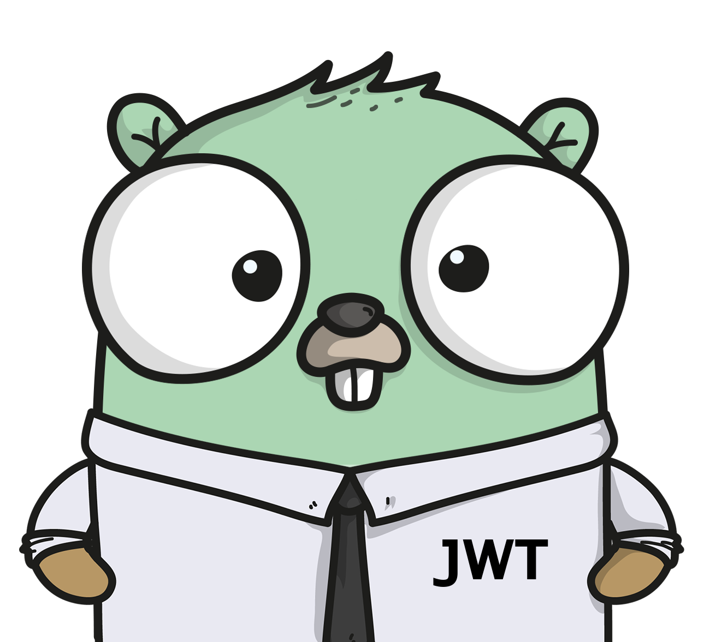

# A JSON Web Token Package for Go
[](https://circleci.com/gh/jrpalma/jwt)
[](https://godoc.org/github.com/jrpalma/jwt)
[](https://goreportcard.com/report/github.com/jrpalma/jwt)


# Table of Contents
- [Documentation](#documenation)
- [Overview](#Overview)
- [Installing](#Installing)
- [Concepts](#concetps)
  * [Tokens](#tokens)
  * [Header](#header)
  * [Claims](#claims)
- [Contributing](#contributing)

# Documentation
You can find the package documentation at https://godoc.org/github.com/jrpalma/jwt

# Overview
JWT is a simple Go package for JSON Web Tokens. The package provides a very simple and functional API. JWT does not attempt to implement the Javascript Object Signing and Encryption (JOSE) standard.
The goal of the package is to provide a very small package with no depencies that can be used to generate, sign, and verify JWT. JWT provides the following features:

* Simple declarative API
* No external depencies
* Token integrity and verification through HMAC SHA256

# Installing
You can install jwt under your GOPATH if your version of Go does not support modules. Run the following command to install jwt under
your GOPATH:
```sh
go get github.com/jrpalma/jwt
```
JWT also supports Go modules. All you have to do is initialize your project and import jwt into your project. If your project has not been initialized, all you have to do is 
run the following command under your project:
```sh
# You will have to specify <project path>
# if you are outside your GOPATH
go mod init <project path>
```

# Concepts
JWT are composed of tree elements: Header, Payload (Claims), and a signature. The API allows the adition of elements to the JWT's Header and Claims. Once a JWT contains the desired header
values and claims, the token can be signed. A JWT can also be verified to ensure its header and claims have not been modified. All this is done by using a combination of a secrete or symmetric
key and HMAC.

## Tokens
A new token can be created by calling the function ```NewJWT()```. This functions returns a new JWT prefilled with a couple of Header values and a Claim. The token has the *type* and *alg* header
values filled with jwt and HS256 respectively. This makes the JWT type jwt and the HMAC algorithm to be of type HMAC SHA256. Also, the Claim "Issued At" is set to the current time. 
The JWT object returned by NewJWT can be signed by calling its Sign method which requires a secret string as its input. The following code creates a jwt token with the issued at claim set to the
current time, signs the token, and return the base64 encoded JWT in the form of "HEADER.PAYLOAD (CLAIMS).SIGNATURE". It then verifies it.

```go
token := NewJWT()
base64JWT, signErr := token.Sign("secrete")
if signErr != nil {
	return signerr
}

verifyErr := token.Verify(base64JWT, "secret")
if verifyErr != nil {
	test.Errorf("Failed to verify token: %v", verifyErr)
}
```

## Header
A JWT header typically consists of two parts: the type of the token, which is JWT, and the signing algorithm being used, such as HMAC SHA256 or RSA. Although the JWT RFC supports RSA for JWT, this
package only support HMAC SHA256. This package allows for other header values to be added or removed from the header section so that JWT's header can be easily extended. The following code creates a JWT token
and adds the header value eventType to the header.
```go
token := NewJWT()
token.Header.Set("eventType", "newUser")

```

## Claims
According to the JWT's website:
> The second part of the token is the payload, which contains the claims. Claims are statements about an entity (typically, the user) and additional data. There are three types of claims: registered, public, and private claims.
>
> **Registered claims:** These are a set of predefined claims which are not mandatory but recommended, to provide a set of useful, interoperable claims. Some of them are: iss (issuer), exp (expiration time), sub (subject), aud (audience), and others.
>
> **Public claims:** These can be defined at will by those using JWTs. But to avoid collisions they should be defined in the IANA JSON Web Token Registry or be defined as a URI that contains a collision resistant namespace.
>
> **Private claims:** These are the custom claims created to share information between parties that agree on using them and are neither registered or public claims.

The following code creates a JWT token, adds some claims, signs it, and verifies it.
```go
token := NewJWT()
token.Claims.Set("user", "jose")
token.Claims.Set("id", "12345666666")

base64JWT, signErr := token.Sign("secret")
if signErr != nil {
	return signerr
}

verifyErr := token.Verify(base64JWT, "secret")
if verifyErr != nil {
	test.Errorf("Failed to verify token: %v", verifyErr)
}
```


# Contributing
1. Fork it
2. Clone it `git clone https://github.com/user_name/arg && cd arg`)
3. Create your feature branch (`git checkout -b my-new-feature`)
4. Make changes and add them (`git add .`)
5. Commit your changes (`git commit -m 'Add some feature'`)
6. Push to the branch (`git push origin my-new-feature`)
7. Create new pull request
